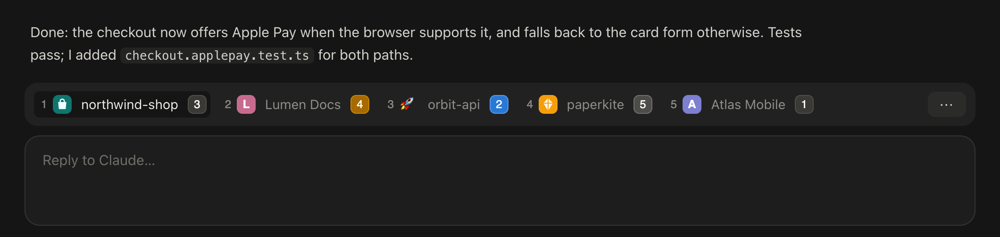
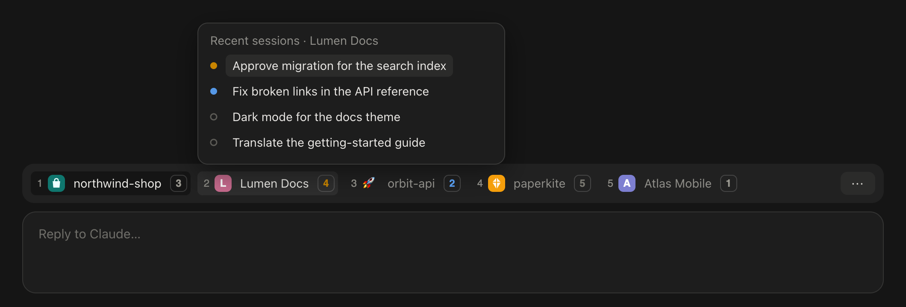
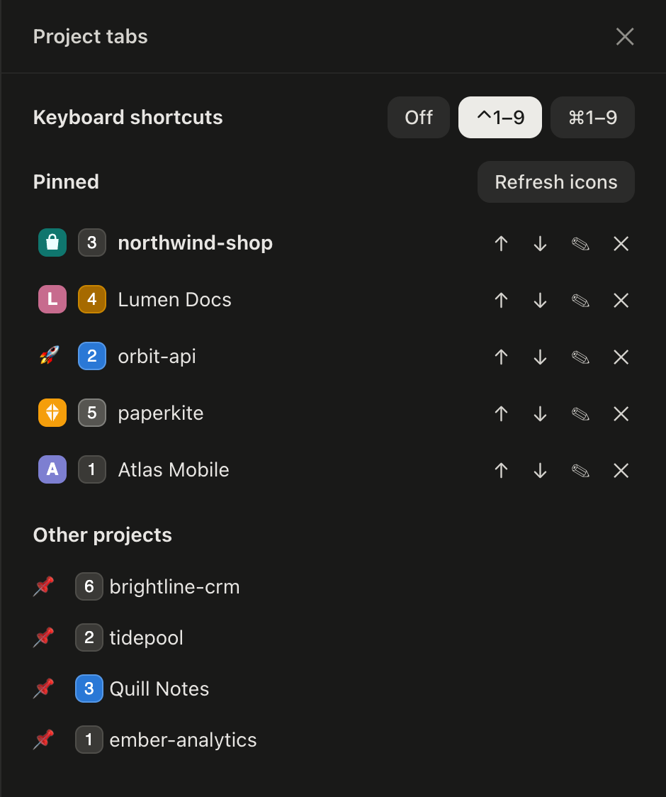

# Claude Tabs — вкладки проектов для Claude Desktop

[English](../README.md) · **Русский**



Мод для **вкладки Code в Claude Desktop** (macOS), который превращает проекты в горизонтальные вкладки над полем ввода, как в браузере:

- **Закреплённые проекты — вкладками**, у каждой иконка: favicon самого проекта, эмодзи, выбранная картинка или цветная буква.
- **Один клик открывает последнюю сессию проекта** — ту, в которой ты был позже всего. Если сессий ещё нет, открывается новая в папке проекта.
- **⌃1…⌃9 (или ⌘1…⌘9) переключают вкладки**, пока Claude на переднем плане.
- **Живой статус сессий** в цветах кружков из сайдбара десктопа: число сессий на вкладке становится жёлто-оранжевым, когда сессия **ждёт тебя** (разрешение или вопрос), синим — когда **закончила и не прочитана**, серым — пока **работает**.
- **При наведении на вкладку** — 5 последних сессий проекта с кружками статуса; клик открывает нужную.
- **Панель настроек** (кнопка `⋯` или `/tabs`): горячие клавиши, закрепить и открепить проекты, поменять порядок, выбрать иконку (выбор файла, эмодзи или авто), обновить иконки.
- **Говорит на твоём языке**: русский, українська, English, Deutsch, Français, Italiano, Español — по языку, выбранному в Claude Desktop; для остальных языков — английский.

Мод сделан на **модах Claude Code** (плагины из функций-хуков) и не патчит само приложение: обновления Claude его не ломают, удаление плагина убирает его полностью.

<p>
  
  
</p>

<sub>Демо-проекты. Вкладки, иконки, счётчики и кружки нарисованы кодом самого мода; картинки собирает [docs/demo/render.ts](demo/render.ts).</sub>

## Требования

- **macOS** и **Claude Desktop** с поддержкой модов (движок Claude Code 2.1.289 и новее, идёт с Claude Desktop 2.26454 и новее).
- Для горячих клавиш: Xcode Command Line Tools (`xcode-select --install`), чтобы собрать маленького помощника, который слушает клавиши.
- Мод рисуется во вкладке Code в Claude Desktop. В терминальном `claude` он тоже загружается и показывает упрощённые текстовые вкладки.

## Установка

### Через маркетплейс (рекомендуется)

```bash
claude plugin marketplace add tripolskiydigital/claude-tabs
```

```bash
claude plugin install project-tabs@claude-tabs
```

Потом открой новую сессию в Claude Desktop, а для уже открытых — закрой Claude через ⌘Q и открой снова. Обновление:

```bash
claude plugin update project-tabs@claude-tabs
```

### Из клона репозитория

```bash
git clone https://github.com/tripolskiydigital/claude-tabs.git ~/claude-tabs
```

И добавь папку в блок `env` файла `~/.claude/settings.json`:

```json
{
  "env": {
    "CLAUDE_CODE_PLUGIN_DIRS": "/Users/you/claude-tabs"
  }
}
```

Используй один из двух способов: если включить оба, мод загрузится дважды.

## Как пользоваться

1. Нажми **📌 Закрепить этот проект** на полосе над полем ввода или открой панель кнопкой `⋯` и закрепи проекты из списка. В списке все папки, где была хотя бы одна сессия Code в Claude Desktop.
2. Клик по вкладке открывает последнюю сессию проекта. Наведи курсор — увидишь недавние сессии.
3. В панели **✎** открывает редактор иконки: **Выбрать файл…** (PNG, JPG, SVG и другие; картинка уменьшается до 64 px и копируется, так что исходник можно перемещать), **Авто** или эмодзи. **Обновить иконки** заново ищет favicon.

Иконка находится автоматически, если она есть в проекте: `favicon.svg/png/ico`, `icon.svg/png`, `apple-touch-icon.png` — в корне, `public/`, `app/`, `static/` или `assets/`, до четырёх уровней вглубь (монорепозитории тоже). Свою иконку без панели можно положить в проект как `.claude/icon.svg` или `.claude/icon.png`.

### Горячие клавиши

По умолчанию выключены. Включаются в панели: **Горячие клавиши** → **⌃1–9** или **⌘1–9**. На вкладках появятся номера: ⌃1 открывает последнюю сессию первого закреплённого проекта, ⌃2 — второго, и так до 9.

Мод не может назначать клавиши в самом Claude Desktop, поэтому при включении он собирает через `swiftc` крошечного помощника из `helper/tabs-hotkeys.swift` (около 100 строк, лежит в этом репозитории) и запускает его через `launchctl submit` как `com.github.tripolskiydigital.claude-tabs.hotkeys`. Файл службы launchd не создаётся: задача живёт до выхода из системы, а мод запускает её снова при старте следующей сессии, пока клавиши включены. Помощник держит клавиши **только пока Claude Desktop на переднем плане**; в остальных приложениях ⌃1…⌃9 работают как раньше. Разрешений «Универсальный доступ» и других ему не нужно, в сеть он не ходит. **Выкл** останавливает его через `launchctl remove`.

⌘1–⌘3 — собственные сочетания Claude Desktop (новый чат, задача, сессия Code); вариант с ⌘ перехватывает их, пока включён. Если на твоём Mac ⌃1…⌃9 переключают рабочие столы (Системные настройки → Клавиатура → Сочетания клавиш → Mission Control), выбери ⌘ или отключи те сочетания.

## Как это работает

Всё остаётся на твоём Mac, мод не делает сетевых запросов.

| Что | Откуда |
| --- | --- |
| Проекты и их сессии | `~/Library/Application Support/Claude/claude-code-sessions/**/local_*.json` — записи сессий самого десктопа (папка, заголовок, последний фокус) |
| Живой статус (работает, ждёт, закончила) | `~/.claude/sessions/*.json` — их пишет каждый запущенный процесс Claude Code |
| Язык интерфейса | поле `locale` из `~/Library/Application Support/Claude/config.json`, его достаёт `grep`: сам файл мод не читает, в нём есть и данные аккаунта |
| Переключение сессий | deep link десктопа `claude://code/continue?session=…`, открывается через `open` |
| Закреплённые проекты и иконки | собственное хранилище плагина; выбранные файлы иконок копируются в `~/.claude/project-tabs/icons/` |
| Горячие клавиши | `~/.claude/project-tabs/hotkeys.json` (какая вкладка куда ведёт), его читает помощник из `~/.claude/project-tabs/bin/` |

«Не прочитана» значит, что сессия закончила работу после того, как ты последний раз её открывал. Мод опрашивает эти файлы раз в 4 секунды и читает только изменившиеся.

## Что мод читает, пишет и запускает

**Ничего не уходит с твоего Mac.** Мод не делает сетевых запросов и никуда не отправляет данные; наружу он передаёт только ссылку `claude://`, которую открывает Claude Desktop на этом же Mac.

**Читает**

- Записи сессий Claude Desktop, `~/Library/Application Support/Claude/claude-code-sessions/**/local_*.json`: папку, заголовок, признак архива и время каждой сессии.
- Файлы запущенных сессий Claude Code, `~/.claude/sessions/*.json`: статус каждой запущенной сессии.
- Папки закреплённых проектов, до четырёх уровней вглубь, в поисках favicon (`favicon.*`, `icon.*`, `apple-touch-icon.png`, `.claude/icon.*`), пропуская `node_modules`, `.git`, результаты сборки и подобное.
- Картинку, которую ты выбираешь как иконку.

**Пишет** — всё в `~/.claude/project-tabs/` (кроме хранилища, которое Claude Code сам ведёт для плагина):

- `icons/`: копии картинок, выбранных как иконки.
- `hotkeys.json`: модификатор и куда ведёт каждая вкладка 1…9. Его читает и выполняет только помощник клавиш. Пишется, только пока клавиши включены.
- `bin/tabs-hotkeys` (и `README` рядом): помощник клавиш, собранный из `helper/tabs-hotkeys.swift`. Только когда ты включаешь клавиши.
- `build/overlay.yaml`, `build/empty.modulemap`: настройка сборки для `swiftc`, пишется только на Mac, где Command Line Tools содержат модуль Swift дважды (известная ошибка упаковки, из-за которой не собирается ничего на Swift); на время этой сборки подменяет дубль пустым файлом.

**Запускает** — каждую программу по имени, с её аргументами:

| Программа | Когда | Зачем |
| --- | --- | --- |
| `open claude://code/…` | клик по вкладке или недавней сессии, нажатие хоткея | переключает Claude Desktop на эту сессию |
| `ps -A -o pid=` | раз в 4 секунды | отличает запущенные сессии от файлов, оставшихся после сбоев |
| `grep -o -m 1 "locale"… config.json` | при старте сессии и при изменении настроек Claude | достаёт язык интерфейса, не давая моду читать файл, где есть и данные аккаунта |
| `osascript helper/choose-icon.applescript "<подсказка>"` | нажатие **Выбрать файл…** | показывает системное окно выбора файла; скрипт лежит в этом репозитории |
| `sips -s format png -Z 64 <картинка> --out <иконка>` | после выбора картинки | уменьшает её до 64 px |
| `swiftc -O -o <помощник> helper/tabs-hotkeys.swift` | включение клавиш или обновление плагина при включённых клавишах | собирает помощника клавиш |
| `launchctl list` / `submit` / `remove` `com.github.tripolskiydigital.claude-tabs.hotkeys` | включение клавиш, старт сессии, выключение | запускает, проверяет и останавливает помощника |

**Хуки и команды**

- `session.start`: регистрирует команду `/tabs`, запускает обновление раз в 4 секунды и перезапускает помощника, если клавиши включены.
- `command.run` только для `/tabs`: открывает панель настроек. Другие команды не затрагиваются.
- `ui.render` для полосы над полем ввода и для собственной панели мода: рисует вкладки и панель.

Мод не перехватывает промпты, вызовы инструментов и переписку и не добавляет Claude инструментов или агентов.

## Ограничения

- Моды не могут менять окно самого приложения: вкладки живут над полем ввода каждой сессии, сайдбар остаётся.
- Статус берётся у процессов, запущенных на этом Mac; у сессии, чей процесс завершён, статуса нет.
- Внешний вид подогнан под текущий интерфейс Claude Desktop; после крупного редизайна приложения мод может потребовать обновления.

## Удаление

Сначала выключи горячие клавиши в панели (**Выкл** останавливает помощника), потом:

```bash
claude plugin uninstall project-tabs@claude-tabs
```

Файлы мода лежат в `~/.claude/project-tabs/`; удали папку, чтобы убрать выбранные иконки и помощника.

## Разработка

```bash
claude plugin validate .
```

```bash
claude plugin test .
```

Модуль — `hooks/register.tsx`, вспомогательные функции — `hooks/lib.ts` и `hooks/hotkeys.ts`, переводы — `hooks/i18n.ts`, контракт состояния — `types/index.d.ts`, помощник для клавиш — `helper/tabs-hotkeys.swift`. Типы API модов Claude Code сам кладёт в `.claude-plugin/types/` при загрузке плагина. Для разработки с горячей перезагрузкой попроси Claude в сессии Code поработать над модом через скилл `plugin-authoring`, указав папку модов сессии на свой клон.

Issues и pull requests приветствуются.

## Лицензия

[Apache 2.0](../LICENSE)
